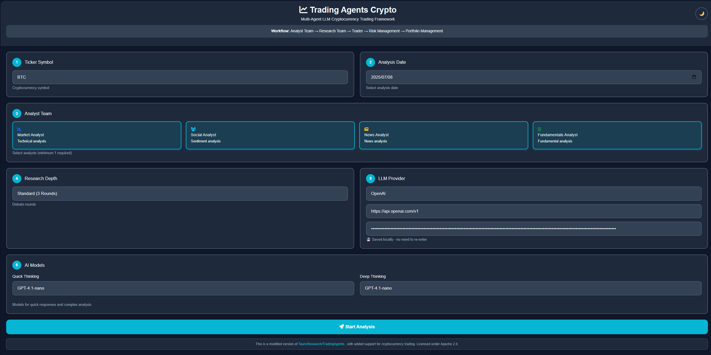
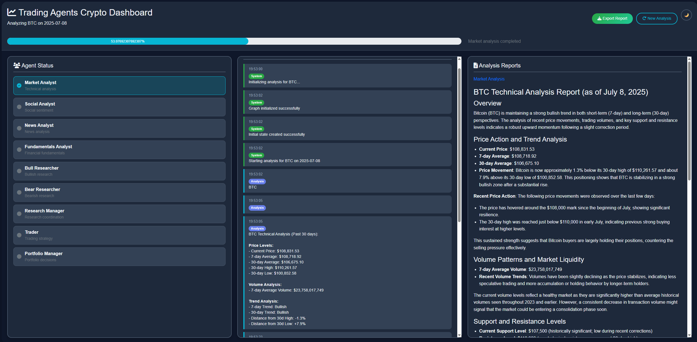

# Trading Agents Crypto 🚀

> **Multi-Agent LLM Cryptocurrency Trading Framework with Web Interface**

A powerful cryptocurrency trading analysis framework powered by multiple specialized AI agents working together to provide comprehensive market insights. This is an enhanced version of [TauricResearch/TradingAgents](https://github.com/TauricResearch/TradingAgents) with **comprehensive cryptocurrency support**, specialized crypto agents, real-time data integration, and a modern responsive web interface.

> 📸 **Check out the [screenshots](#-screenshots)** to see the beautiful light/dark mode interface and real-time dashboard in action!

## ✨ Features

### 🌐 **Modern Web Interface**
- **Dark/Light Mode**: Eye-friendly themes with smooth transitions *(see screenshots below)*
- **Real-time Dashboard**: Live updates of agent status and analysis progress
- **Interactive Forms**: Easy configuration of analysis parameters
- **Responsive Design**: Works seamlessly on desktop and mobile devices
- **Professional UI**: Clean, modern design optimized for crypto trading workflows

### 🤖 **Multi-Agent Architecture**
- **Analyst Team**: Market, Social, News, and Fundamentals analysis specialists
- **Research Team**: Bull and Bear researchers with debate-driven insights
- **Trading Team**: Strategy formulation and risk assessment
- **Portfolio Management**: Final decision making and trade execution

### 💰 **Cryptocurrency Focus**
- **Native Crypto Support**: Built-in support for popular cryptocurrencies (BTC, ETH, ADA, etc.)
- **Crypto Market Data**: Real-time price feeds, volume analysis, and market cap tracking
- **Social Sentiment**: Reddit, Twitter, and crypto community sentiment analysis
- **News Integration**: Crypto-specific news sources and market impact assessment
- **Technical Analysis**: Crypto-adapted indicators (RSI, MACD, Bollinger Bands for volatile markets)
- **On-chain Metrics**: Integration with blockchain data sources
- **DeFi Analytics**: Decentralized finance protocol analysis and yield farming insights

### 🧠 **LLM Integration**
- **Multiple Providers**: Support for OpenAI, Anthropic, Google, and DeepSeek models
- **Latest Models**: Including GPT-4, Claude Sonnet/Opus, Gemini 2.0/2.5, and DeepSeek V2
- **Quick & Deep Thinking**: Separate models for fast responses and complex analysis
- **API Key Management**: Secure API key input and management

## 🆕 **What's New for Crypto Support**

This fork adds comprehensive cryptocurrency trading capabilities to the original TradingAgents framework:

### **Enhanced Data Sources**
- **CoinGecko API**: Real-time crypto prices, market caps, and volume data
- **CryptoCompare**: Historical data and social metrics
- **Crypto News APIs**: Specialized crypto news aggregation
- **Social Media Integration**: Reddit sentiment analysis for crypto communities
- **On-chain Data**: Blockchain transaction metrics and wallet analysis

### **Crypto-Specific Agents**
- **DeFi Analyst**: Specialized in decentralized finance protocols and yield analysis
- **Tokenomics Analyst**: Token supply, distribution, and economic model analysis
- **Chain Analyst**: Cross-chain analysis and bridge monitoring
- **NFT Market Analyst**: Non-fungible token market trends and analysis

### **Market-Adapted Features**
- **24/7 Trading**: Crypto markets never close - agents adapted for continuous operation
- **Volatility Management**: Enhanced risk assessment for crypto's high volatility
- **Multi-Exchange Support**: Analysis across different crypto exchanges
- **Stablecoin Integration**: USDT, USDC, DAI analysis for portfolio stability
- **Regulatory Monitoring**: Crypto regulation tracking and impact analysis

### **Technical Enhancements**
- **WebSocket Streams**: Real-time crypto price feeds
- **Portfolio Rebalancing**: Dynamic crypto portfolio management
- **Yield Farming Analysis**: DeFi yield opportunity identification
- **Cross-chain Analytics**: Multi-blockchain analysis capabilities

## 📸 Screenshots

### **Light Mode Interface**

*Clean and professional light mode interface with intuitive crypto analysis configuration*

### **Dark Mode Interface** 

*Eye-friendly dark mode perfect for extended trading sessions*

### **Real-time Analysis Dashboard**

*Live dashboard showing multi-agent analysis progress with real-time updates*

## 🚀 Quick Start

> **Note**: This crypto-enhanced version includes specialized agents and data sources optimized for cryptocurrency trading analysis.

### Prerequisites
- Python 3.8 or higher
- Node.js (for web dependencies)
- API keys for your chosen LLM provider
- FinnHub API key for financial data
- Optional: CoinGecko API for enhanced crypto data (free tier available)

### Installation

1. **Clone the repository**
   ```bash
   git clone https://github.com/yourusername/trading-agents-crypto.git
   cd trading-agents-crypto
   ```

2. **Create virtual environment**
   ```bash
   python -m venv venv
   source venv/bin/activate  # On Windows: venv\Scripts\activate
   ```

3. **Install dependencies**
   ```bash
   pip install -r requirements.txt
   ```

4. **Set up environment variables**
   ```bash
   export FINNHUB_API_KEY=your_finnhub_api_key
   # Note: LLM API keys are entered via the web interface
   ```

5. **Run the web application**
   ```bash
   python web_app.py
   ```

6. **Open your browser**
   Navigate to `http://localhost:5000` to access the web interface

## 🎯 Usage

### Web Interface Workflow

1. **Configure Crypto Analysis**
   - Enter cryptocurrency symbol (e.g., BTC, ETH, ADA, MATIC, SOL)
   - Select analysis date
   - Choose specialized crypto analyst team members
   - Set research depth level (market conditions, DeFi analysis, etc.)
   - Configure LLM provider and models
   - Enter your API key

2. **Start Analysis**
   - Click "Start Analysis" to begin
   - Automatically redirected to real-time dashboard
   - Monitor live progress with visual agent status indicators
   - View agent status updates and analysis messages as they stream

3. **Review Results**
   - Examine detailed reports from each specialized agent
   - Export comprehensive analysis results (HTML format)
   - Switch between light/dark mode for optimal viewing
   - Start new analysis with different parameters

### Supported LLM Providers

#### **OpenAI**
- GPT-4o, GPT-4.1 series
- o1, o3, o4 reasoning models
- API endpoint: `https://api.openai.com/v1`

#### **Anthropic**
- Claude Haiku 3.5, Sonnet 3.5/3.7/4
- Claude Opus 4 (Deep Thinking)
- API endpoint: `https://api.anthropic.com/`

#### **Google**
- Gemini 2.0 Flash-Lite, 2.0 Flash, 2.5 Flash
- Gemini 2.5 Pro
- API endpoint: `https://generativelanguage.googleapis.com/v1`

#### **DeepSeek**
- DeepSeek Chat, DeepSeek Coder, DeepSeek V2
- DeepSeek V2 R1 (Reasoning model)
- API endpoint: `https://api.deepseek.com/v1`

## 🏗️ Architecture

### Agent Workflow
```
Analyst Team → Research Team → Trader → Risk Management → Portfolio Management
```

### Web Technology Stack
- **Backend**: Flask + SocketIO for real-time communication
- **Frontend**: Bootstrap 5 + FontAwesome for modern UI
- **Real-time**: WebSocket connections for live updates
- **Theme**: Dark/Light mode with CSS variables

## 📊 Analysis Components

### **Analyst Team**
- 📈 **Market Analyst**: Technical indicators and price patterns
- 📱 **Social Analyst**: Social media sentiment and trends
- 📰 **News Analyst**: News events and market impact
- 📋 **Fundamentals Analyst**: Project fundamentals and metrics

### **Research Team**
- 🐂 **Bull Researcher**: Optimistic market perspectives
- 🐻 **Bear Researcher**: Risk assessment and concerns
- ⚖️ **Research Manager**: Balanced decision coordination

### **Trading Team**
- 💼 **Trader**: Strategy formulation and timing
- 🛡️ **Risk Manager**: Risk assessment and mitigation
- 📊 **Portfolio Manager**: Final execution decisions

## 🔧 Configuration

### Environment Variables
```bash
FINNHUB_API_KEY=your_finnhub_key      # Required for financial data
```

### LLM Configuration
LLM API keys and model selection are configured through the web interface for security and flexibility.

## 📝 API Documentation

### REST Endpoints
- `GET /` - Main configuration page
- `GET /analysis` - Analysis dashboard
- `POST /api/start_analysis` - Start new analysis

### WebSocket Events
- `join_session` - Join analysis session
- `new_message` - Real-time message updates
- `agent_status_update` - Agent status changes
- `progress_update` - Analysis progress updates

## ⚠️ Disclaimer

This framework is designed for research and educational purposes. Trading performance may vary based on many factors, including model selection, market conditions, and data quality. **This is not financial advice.** Always conduct your own research and consider consulting with financial professionals before making trading decisions.

## 🚧 **Next Features**

We're continuously working to enhance the cryptocurrency trading capabilities. Here's what's coming next:

### **🔗 Enhanced Data Sources**
- **Binance API Integration**: Direct integration with Binance for real-time order book data
- **Coinbase Pro API**: Professional trading data and advanced metrics
- **DeFiPulse Integration**: TVL (Total Value Locked) tracking across DeFi protocols
- **Messari API**: Comprehensive crypto asset metrics and research data
- **The Graph Protocol**: Decentralized blockchain data indexing
- **Dune Analytics**: On-chain analytics and custom dashboard integration
- **Alternative Data**: Social media influence metrics, GitHub activity, and developer engagement

### **🤖 Optimized Agent Prompts for Multi-Agent Collaboration**
- **Inter-Agent Communication**: Enhanced protocols for agents to share insights more effectively
- **Consensus Mechanisms**: Advanced voting and agreement systems between agents
- **Conflict Resolution**: Automatic handling of contradictory analysis from different agents
- **Context Sharing**: Improved memory and context passing between agent interactions
- **Role Specialization**: More granular agent roles with specialized expertise
- **Dynamic Team Formation**: Adaptive agent team composition based on market conditions
- **Learning from Interactions**: Agents learn from past collaborative successes and failures

### **📊 Advanced Analytics**
- **Sentiment Heat Maps**: Visual representation of market sentiment across different timeframes
- **Cross-Asset Correlation**: Analysis of crypto correlations with traditional markets
- **Liquidity Analysis**: Deep dive into market liquidity and slippage estimation
- **MEV Analysis**: Maximum Extractable Value opportunities in DeFi
- **Governance Token Analysis**: DAO proposal and voting impact assessment

### **🛠️ Platform Enhancements**
- **Mobile App**: Native mobile application for iOS and Android
- **Telegram Bot**: Real-time alerts and analysis via Telegram integration
- **Portfolio Tracking**: Advanced portfolio management with P&L tracking
- **Backtesting Engine**: Historical strategy testing and optimization
- **Paper Trading**: Risk-free strategy testing with simulated trades

## 📄 License

This project is licensed under the Apache 2.0 License - see the original [TauricResearch/TradingAgents](https://github.com/TauricResearch/TradingAgents) repository for details.

## 🙏 Acknowledgments

- Original framework by [TauricResearch](https://github.com/TauricResearch)
- Built with [LangGraph](https://langchain-ai.github.io/langgraph/) for agent orchestration
- UI components from [Bootstrap](https://getbootstrap.com/) and [FontAwesome](https://fontawesome.com/)
